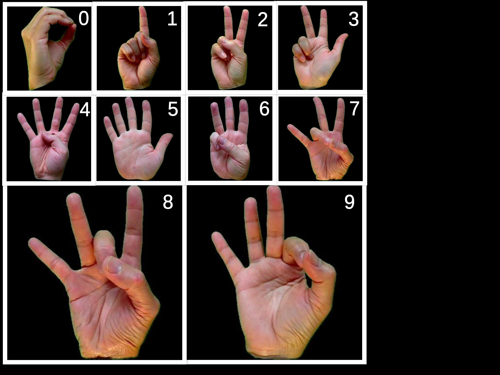
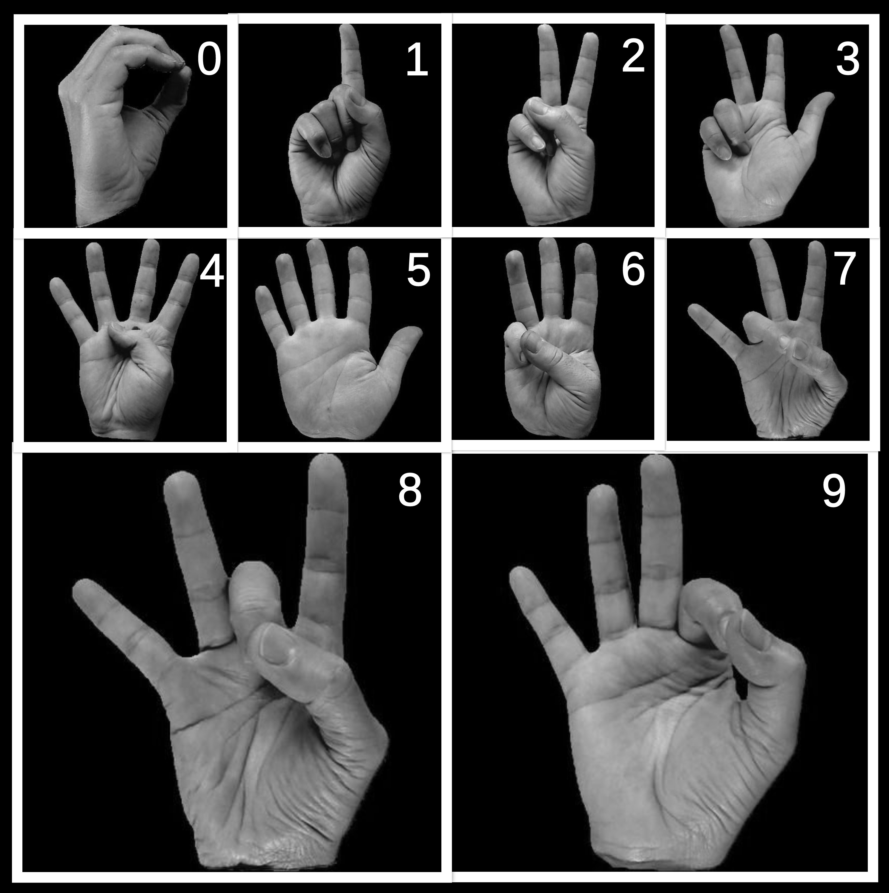
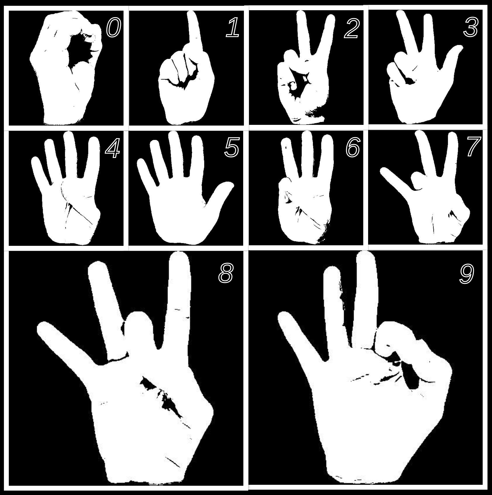
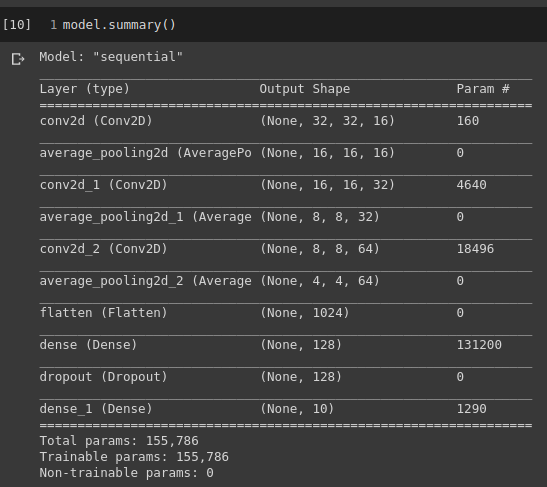
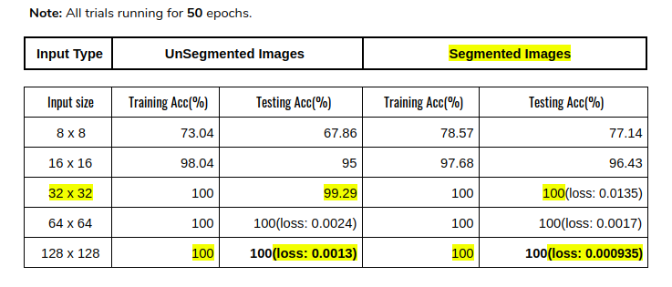
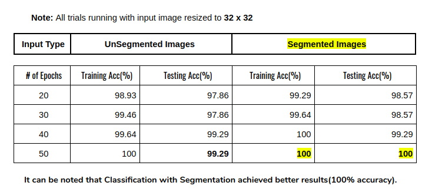

# Digit classification from hand signs using CNN
----------------------------------
* Dataset		: 	American Sign Language Dataset
* Dataset link	:	https://www.kaggle.com/ayuraj/asl-dataset
* Dataset size	:	31MB
* \# of images	:	700 { each of size **400 x 400**, all **‘.jpeg’** RGB color space files }
* Target Output	:	1 out of 10 classes (0, 1, 2, 3, 4, 5, 6, 7, 8, 9)
* Training set	:	**560** images
* Testing set	:	**140** images (test_size = 0.2)
--------------------------------------------------------------

### Index Terms: { Convolution, Average pooling, segmentation using K-means clustering, SeLU activation, Multi-class Classification }
-------------------------------------------------------------------
### Abstract:
* Modeled a CNN with 3 convolution and average pooling layers simultaneously, and a Fully Connected Layer followed by an output layer with SeLU activation.
* The input images from the dataset are of size 400 x 400.
* Resized the input to 8x8, 16x16, 32x32, 64x64, 128x128 sizes running multiple trials with varying epochs.
* Overall, achieved a training accuracy of 100% and testing accuracy of 100% for the input sizes 32x32 and above, after 50 epochs.

### Raw input from the dataset:
* Sample images:
                    

-----------------------------------------------------------
### Pre-Processing:

* It can be observed that visual information like shape is predominant here, whereas chrominance information is of least importance.
* So, the color images are converted to grayscale images for better classification performance of the model.
                    

* Also performed Semantic Segmentation of the images using K-means clustering with K=2.
* Observed that segmentation helped classification and achieved better results.
                    
------------------------------------------------------------

### Model Summary:
* summary:
                    
---------------------------------------

### Results:
* results:
                    
                    
----------------------------------

### Conclusion:
* The proposed model converged after 50 epochs with a total of 1,55,786 parameters all trainable.
* I also built a complex model [1](https://drive.google.com/drive/u/1/folders/1--GzydCeMJYeCl1d5XRtCeVAB4anHSQy) with around 16 lac parameters, which converges to 100% accuracy only after 4 to 5 epochs.
* But the proposed model in this repository is simple and robust enough, being state-of-the-art for the dataset, converging after about 50 epochs achieving 100% accuracy.
