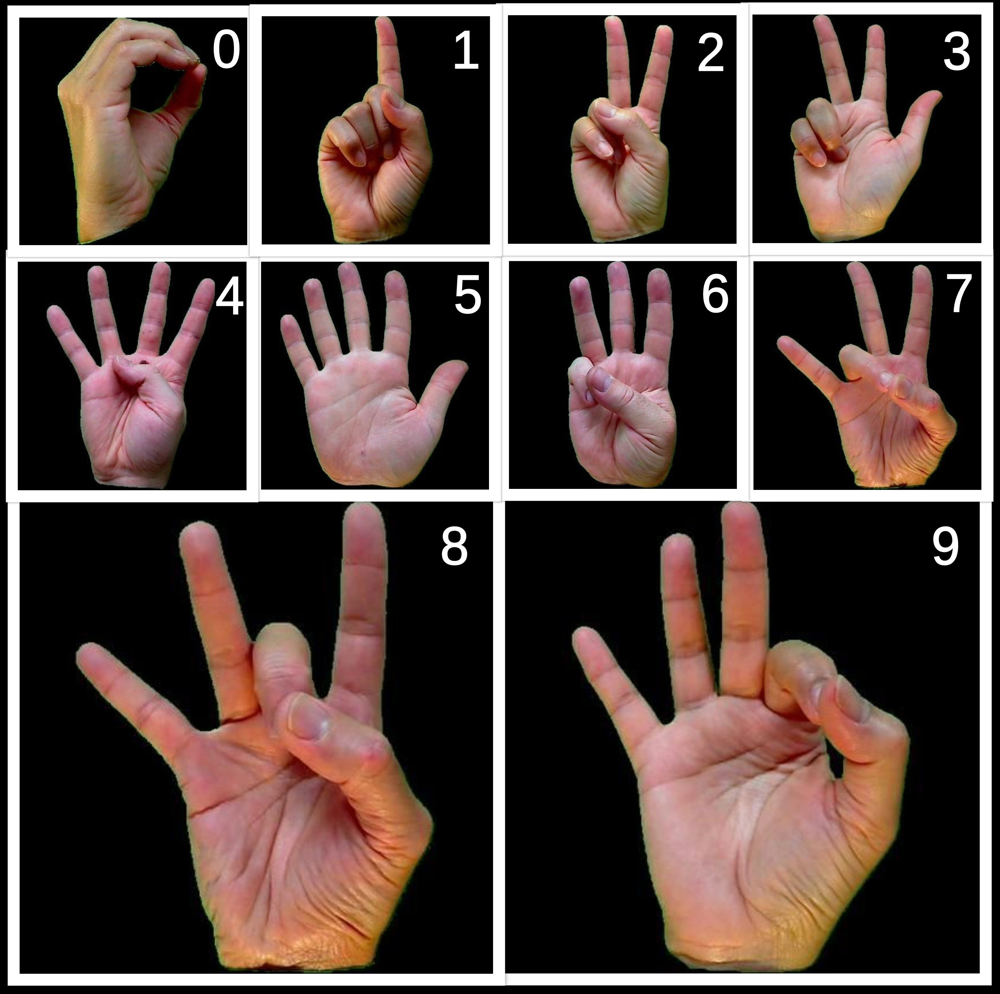

# Digit classification from hand signs using CNN

----------------------------------
|  |  |
| ------ | ------ |
| Dataset  | American Sign Language Dataset |
| Dataset link | <https://www.kaggle.com/ayuraj/asl-dataset> |
| Dataset size | 31MB |
| \# of images | 700 { each of size **400 x 400**, all RGB color space **‘.jpeg’** files } |
| Training set | **560** (had a further split for validation set- {split_size1 = 0.1} ) |
| training size | 504 |
| validation size | 56 |
| Testing set | **140** images (test_size = 0.2) |
| Target Output | 1 out of 10 classes (0, 1, 2, 3, 4, 5, 6, 7, 8, 9) |

--------------------------------------------------------------

### Index Terms: { Convolution, Average pooling, segmentation using K-means clustering, ReLU & SELU activations, Multi-class Classification }
-------------------------------------------------------------------
### Abstract:
* Modeled a CNN with 3 convolution and average pooling layers with ReLU activation, and a Fully Connected Dense Layer followed by an output layer with SELU activation.
* The input images from the dataset are of size 400 x 400.
* All the input images are resized dynamically to 8x8, 16x16, 32x32, 64x64, 128x128 sizes running multiple trials with varying epochs.
* Overall, achieved training and validation accuracies of 100% both and testing accuracy of 100% for the input sizes 64x64 and above, after 50 epochs and above.
* Segmented the input images using K-means clustering for better accuracies.

### Raw input from the dataset:
* Sample images:

* **1** All splits are made maintaining the class equality in each set(test, train, validation) so that the model would not be biased towards a specific class.
-----------------------------------------------------------
### Pre-Processing:

* It can be observed that visual information like shape is predominant here, whereas chrominance information is of least importance.
* So, the color images are converted to grayscale images for better classification performance of the model.

* Also performed **Semantic Segmentation** of the images using K-means clustering with **K=2**.
* Observed that segmentation helped classification and achieved better results.
* **The model with segmented input data outperformed the one with grayscale images as input.**

------------------------------------------------------------

### Model Summary:
* 

### Results:

----------------------------------

### Conclusion:
* The proposed model converged after 50 epochs with a total of 1,55,786 parameters all trainable.
* I also built a complex model [{click here for the saved model}](https://drive.google.com/drive/u/1/folders/1--GzydCeMJYeCl1d5XRtCeVAB4anHSQy) with around 16 lac parameters, which converges to 100% accuracy only after 4 to 5 epochs.
* But the proposed model in this repository is simple and robust enough, being state-of-the-art for the dataset, converging after about 50 epochs achieving 100% accuracy.
